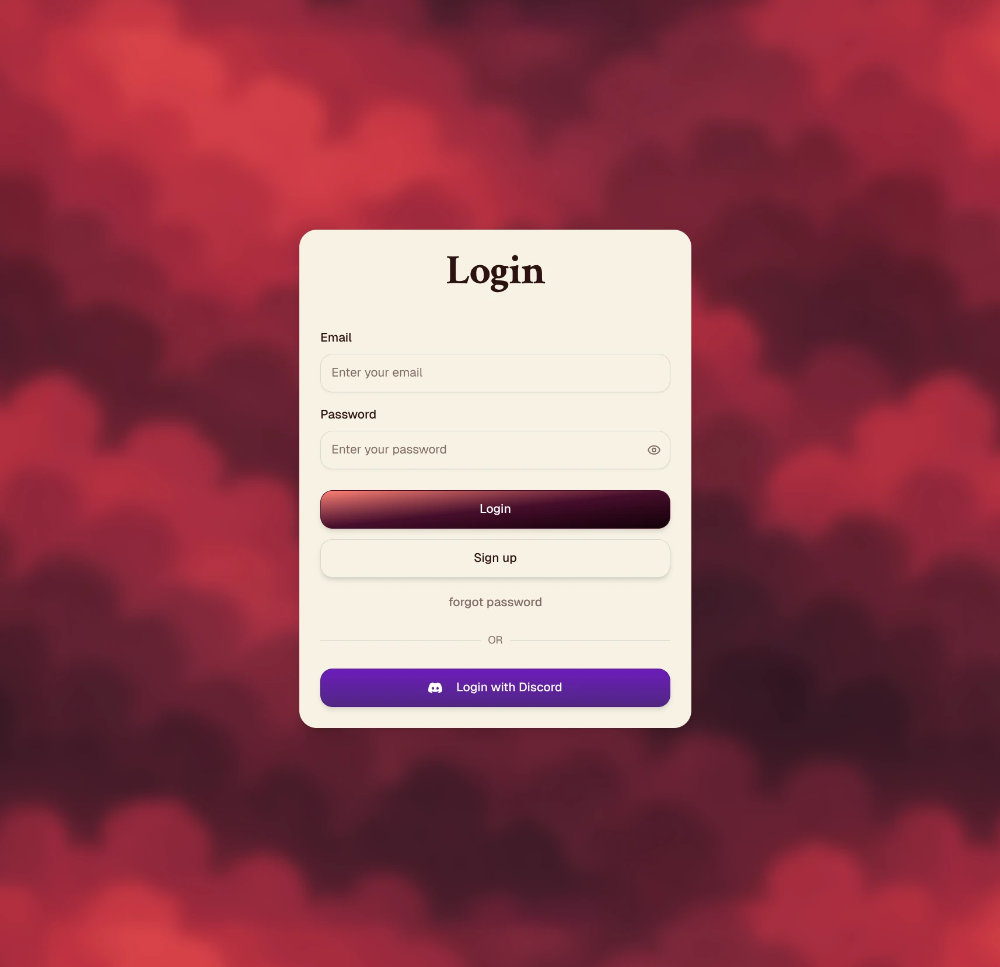

# Polls [WORK IN PROGRESS]

Make polls for you and your friends!



## Features

- [ ] List public polls
- [ ] List private polls (internal)
- [ ] Create a poll
- [ ] Create a poll step
- [ ] Create a poll step question
- [ ] Create the answers for each question
- [ ] Configure poll settings
  - [ ] Public or private
  - [ ] Anon responses
  - [ ] Start and end date
  - [ ] Password (maybe add some cryptography)
- [ ] Configure poll step
  - [ ] Required
- [ ] Configure poll question
  - [ ] Required
  - [ ] Other
  - [ ] Question type
  - [ ] Markdown support
  - [ ] Open Graph link preview
- [ ] Answer poll anonymously
- [ ] Answer poll signed in
- [ ] Render markdown safely + og link preview
- [ ] Review results
- [ ] Share results
- [ ] Config result sharing
  - [ ] Public or private
  - [ ] Password

## Getting Started

```bash
pnpm dev
```
